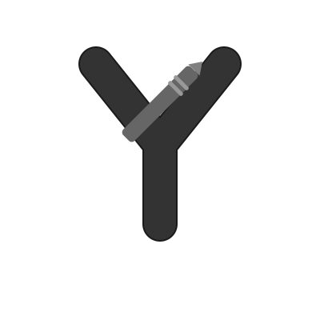

<div align="center">
  
  <h1>VoidNote</h1>
  <p><em>Voice-first conversation capture.</em></p>

  <a href="https://opensource.org/licenses/MIT">
    
  </a>
  <a href="http://makeapullrequest.com">
    
  </a>
  <a href="https://nodejs.org/">
    =16">
  </a>
</div>

---

## Features

- **Live Speech-to-Text** – Real-time transcription with low latency.
- **Structured Parsing** – Breaks down chaotic dialogue into readable sections.
- **Inline Editing** – Modify transcriptions without losing speaker context.
- **Contextual Sorting** – Automatically classifies meetings by type or tag.
- **Instant Sharing** – Push summaries to teammates. Or don't. Your call.

---

## Getting Started

### Requirements

- Node.js v16 or higher
- Chromium-based browser with microphone access
- Internet (cloud inference dependency)

---

### Install

```bash
git clone https://github.com/rishit-singh/voidnote.git
cd voidnote
npm install
cp .env.example .env
# edit .env as needed
```

---

### Run

```bash
npm run dev
```

Navigate to [`http://localhost:3000`](http://localhost:3000)

---

## Contributing

We don’t bite. Fork, branch, commit, push, PR. 

```bash
git checkout -b feat/my-thing
git commit -m "Add: my thing"
git push origin feat/my-thing
```

Open a pull request. If you break something in style, we might even keep it.

---

#### DOCS COMING SOON™   

## License

MIT. Use it, remix it.

---

## Support

- [Issues](https://github.com/rishit-singh/voidnote/issues)
- Contact: [X](https://x.com/__coderish__)

---

<div align="center">
  <strong>The Null Node</strong>
</div>

